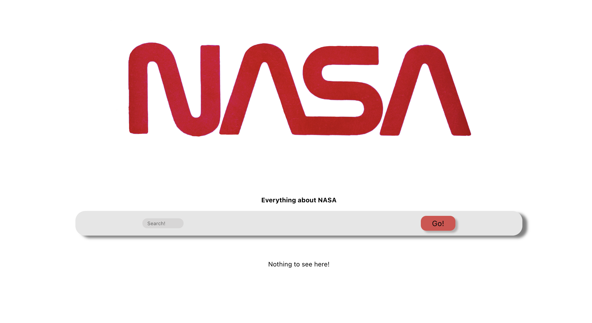
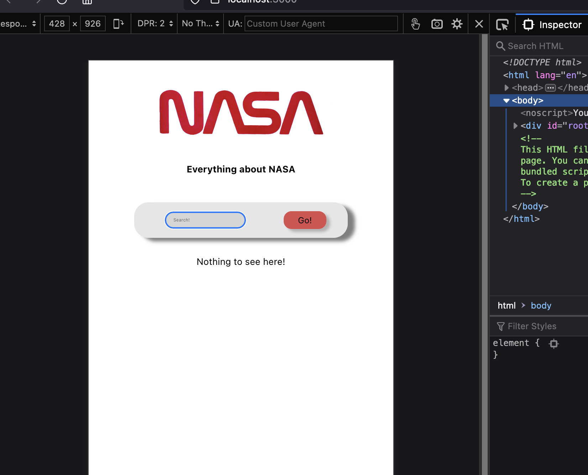

<a name="readme-top"></a>

[![LinkedIn][linkedin-shield]][linkedin-url]
[![Downloads][download-badge]][download-url]
[![LastCommit][commit-badge]][commit-url]

<!-- PROJECT LOGO -->
<h3 align="center">React Technical Test</h3>

  <p align="center">
    A small app which brings back images of planets, galaxys and stars from the NASA Api. 
    <br />
    ·
    <a href="https://github.com/MaJaWh/tech-test">Report Bug</a>
    ·
</div>

<!-- TABLE OF CONTENTS -->
<details>
  <summary>Table of Contents</summary>
  <ol>
    <li>
      <a href="#about-the-project">About The Project</a>
      <ul>
        <li><a href="#Packages and Depandancies">Packages and Dependancies</a></li>
      </ul>
    </li>
    <li>
      <a href="#getting-started">Getting Started</a>
      <ul>
        <li><a href="#prerequisites">Prerequisites</a></li>
        <li><a href="#installation">Installation</a></li>
      </ul>
    </li>
    <li><a href="#usage">Usage</a></li>\
    <li><a href="#roadmap">Roadmap</a></li>
    <li><a href="#contact">Contact</a></li>
    <li><a href="#acknowledgments">Acknowledgments</a></li>
  </ol>
</details>

<!-- ABOUT THE PROJECT -->

## About The Project
A week long mock technical test using the NASA api to bring back images of planets, stars and galaxies. This test was designed to give us a real world idea of what a prospective employer would look for. Simple search functionality has been implemented to bring back an array everythingn contained in the api relating to the keyword entered in the search query. This array is then filtered to show only the images. These images are then rendered in the browser window where CSS has been implemented
to allow for scaling.
If a query entered onto the search bar doesnt match anything in the API, an error message will be displayed on the screen. 

 - 
 - 

<p align="right">(<a href="#readme-top">back to top</a>)</p>

### Testing Utilities Used

<p align="right">(<a href="#readme-top">back to top</a>)</p>

### Packages and Dependancies

- [![Java-script][javascript-shield]][javascript-url]
- [![Node.js][node-shield]][node-url]
- [![React.js][react.js]][react-url]
- [![CSS][CSS]][CSS-url]
- [![HTML][HTML]][HTML-url]

<p align="right">(<a href="#readme-top">back to top</a>)</p>

## Getting Started

### Installation

1. Clone the repo into your chosen file
   ```sh
   git clone https://github.com/MaJaWh/weather-app
   ```
2. Install NPM packages
   ```sh
   npm install
   ```

### Testing   
- Testing
   ```sh
   npm test
   ```

###  Running the Development Server  
- npm
   ```sh
   npm start
   ```    
   <!-- 3. Enter your API in `config.js`
      ```js
      const API_KEY = 'ENTER YOUR API';
      ``` -->

<p align="right">(<a href="#readme-top">back to top</a>)</p>

<!-- USAGE EXAMPLES -->

<!-- CONTACT -->

## Contact

Your Name - [@twitter_handle](https://twitter.com/twitter_handle)

Project Link: [https://github.com/MaJaWh/weather-app](https://github.com/MaJaWh/weather-app)

<p align="right">(<a href="#readme-top">back to top</a>)</p>

<!-- ACKNOWLEDGMENTS -->

<!-- MARKDOWN LINKS & IMAGES -->

[commit-badge]: https://img.shields.io/github/last-commit/MaJAWh/music-library
[commit-url]: https://github.com/MaJaWh/music-library

[javascript-url]: https://www.javascript.com/
[javascript-shield]: https://img.shields.io/badge/JavaScript-F7DF1E?style=for-the-badge&logo=javascript&logoColor=black

[CSS]: https://img.shields.io/badge/CSS3-1572B6?style=for-the-badge&logo=css3&logoColor=white
[CSS-url]: https://www.w3.org/Style/CSS/Overview.en.html

[HTML]: https://img.shields.io/badge/HTML5-E34F26?style=for-the-badge&logo=html5&logoColor=white
[HTML-url]: https://html.com/

[node-shield]: https://img.shields.io/badge/Node.js-43853D?style=for-the-badge&logo=node.js&logoColor=white
[node-url]: https://nodejs.org/en/

[linkedin-shield]: https://img.shields.io/badge/-LinkedIn-black.svg?style=for-the-badge&logo=linkedin&colorB=555
[linkedin-url]: https://www.linkedin.com/in/mjamesw/

[product-screenshot]: images/screenshot.png

[react.js]: https://img.shields.io/badge/React-20232A?style=for-the-badge&logo=react&logoColor=61DAFB
[react-url]: https://reactjs.org/
